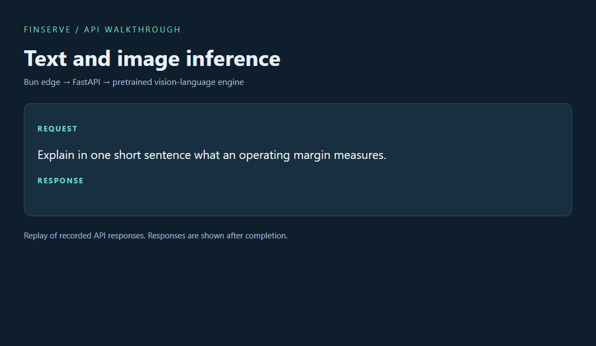
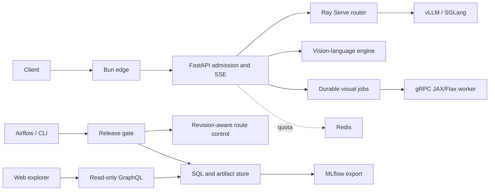

# FinServe

FinServe is a distributed text and multimodal inference platform for developers running model-backed applications. It accepts text prompts and images, streams model responses, coordinates visual jobs, and controls how serving revisions reach users.

Model serving needs more than a completion endpoint. Slow clients can hold capacity, cancelled requests can leave work running, and a model update can change answer behavior. FinServe gives these concerns explicit owners: bounded admission, engine-aware routing, durable jobs, and gated releases with rollback.

[Documentation](docs/README.md) | [Run locally](docs/run-free.md) | [API contracts](docs/api-contracts.md)

## Demo



Replay of recorded text and image API responses through Bun and FastAPI to a pretrained vision-language model. The display shows completed responses rather than live browser streaming.

## Key features

- **Text and image inference:** FastAPI streaming endpoints, vLLM/SGLang adapters, and validated PNG inputs.
- **Distributed routing:** Ray Serve routes to eligible engine processes with bounded leases and GPU-aware policies.
- **Engine optimization controls:** continuous batching, prefix caching, and configurable speculative-decoding experiments.
- **Durable visual jobs:** a JAX/Flax reference generator behind gRPC, with idempotent submission, cancellation fencing, and verified output artifacts.
- **Release control:** shared CLI and Airflow gates, immutable model and image identities, probation checks, and generation-checked warm rollback.
- **Operational visibility:** a read-only run explorer, MLflow exports, Prometheus dashboards, and OpenTelemetry traces.

## Run locally

Install Python 3.12 and [uv](https://docs.astral.sh/uv/). Start the CPU transport fixture:

```sh
git clone https://github.com/chinmayarvind23/fin-serve.git
cd fin-serve
uv sync --frozen
uv run uvicorn finserve.gateway.app:from_env --factory --host 127.0.0.1 --port 8000
```

In another terminal:

```sh
curl -N http://127.0.0.1:8000/v1/completions   -H 'Content-Type: application/json'   -d '{"prompt":"hello","max_tokens":5}'
```

The fixture echoes character tokens to exercise the API without model weights. For pretrained inference, follow the [local NVIDIA GPU recipe](docs/run-free.md#real-text-inference-on-a-local-nvidia-gpu). The same guide starts the Docker-based explorer. Bun is required when running the web services directly; Kubernetes is optional for local use.

Set `FINSERVE_API_KEY` for authenticated requests. Configure a separately running engine with `FINSERVE_ENGINE`, `FINSERVE_ENGINE_URL`, and `FINSERVE_MODEL`. Keep credentials, databases, and model files outside the checkout.

```sh
uv run pytest tests/unit
```

[Development commands](docs/commands.md) cover optional dependencies, integration checks, and release workflows.

## Technology

**Python · FastAPI · Ray Serve · vLLM/SGLang · Airflow · MLflow**

Python and FastAPI expose streaming inference APIs, Ray Serve coordinates routing across eligible engine processes, and vLLM/SGLang own GPU model execution and batching. Airflow coordinates release workflows, while MLflow records model and benchmark evidence. SQLite and SQLAlchemy support durable local job and release state.

### Integrations

Configure the integrations your deployment needs:

- **Model execution:** PyTorch provides the reference decoder, while JAX/Flax and gRPC support the visual reference worker.
- **State and quotas:** Redis provides shared quota state; PostgreSQL and S3 adapters support persistent metadata and artifacts beyond the local SQLite path.
- **Observability:** OpenTelemetry traces requests and model operations, with Prometheus and Grafana for metrics and dashboards.
- **Edge and application:** Bun/TypeScript provides the edge layer and GraphQL exposes read-only experiment evidence.
- **Infrastructure:** Docker supports local services; KubeRay, Helm and Terraform define operator-managed Kubernetes and AWS deployment paths.

## How it works

The edge authenticates a request and forwards it to FastAPI. Admission and deadlines bound the request before it reaches an engine. Ray can choose an eligible backend; the engine owns GPU execution and token batching. The gateway streams output and keeps its lease until completion or cancellation cleanup.

Visual jobs take a durable path through SQLite and a gRPC worker. Release workflows use immutable artifacts and a shared gate before switching traffic. The explorer reads registered runs through GraphQL; deployment authority stays with the operator workflow.

## Architecture at a glance



[High-level design](docs/HLD.md) explains service ownership. [Low-level design](docs/LLD.md) follows contracts, cancellation, and state transitions. [Deployment](docs/deployment.md) describes local processes and cluster configuration.

## Further development

- **Product:** guided model onboarding and clearer recovery actions in the explorer.
- **Architecture:** multi-GPU placement and a shared durable route store for multiple control-plane instances.
- **Engineering and scalability:** node-loss exercises, repeatable workload replay, and simpler deployment profiles while preserving explicit resource ownership.
