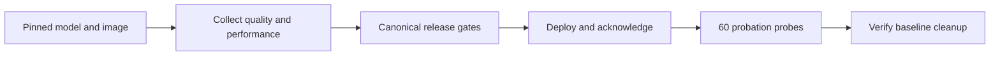
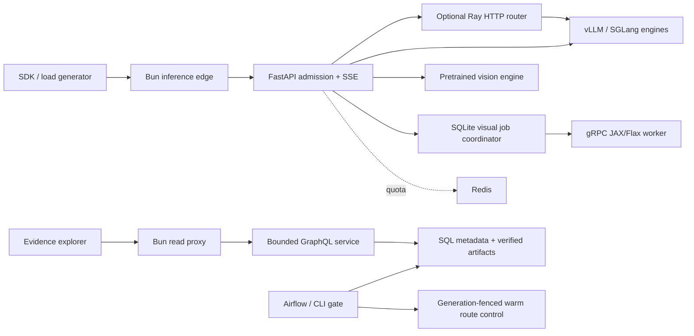

# FinServe

FinServe runs text and image inference, compares serving configurations, and automates GPU releases with quality gates, rollback and replica lifecycle control. It connects PyTorch and JAX/Flax workers, vLLM/SGLang engines, Ray routing, FastAPI/gRPC, Redis, MLflow and Airflow. Optional EKS/KubeRay and Terraform definitions support a user-run cloud deployment.

**Verified locally:** full GPU release workflow, automatic one-to-two-to-one engine scaling, a recorded text/image demo, and 1,134 passing CPU tests.

[Live results and charts](https://huggingface.co/spaces/chinmayarvind/finserve) | [Run locally](docs/run-free.md) | [Design guide](docs/README.md) | [Resume bullets](docs/resume-bullets.md)

[Trace the full stack and measured claims to code and verification](docs/stack-verification.md).

## Results at a glance

| Experiment | Measured result | What it establishes |
| --- | --- | --- |
| Latest 3B prefix-cache release | **247 to 116 ms median client TTFT**, 512/512 measured requests completed | **53.1% lower client TTFT** in a short ordered local comparison |
| Release correctness | **32/32 correct, 100% baseline parity** | Passed the consumed release suite and canonical deployment gate |
| Historical sustained compiled serving | **2.64x token throughput**, **62.3% lower p95**, 6,144 measured requests completed | Speed improvement in a separate experiment whose quality gate failed |
| Automatic model capacity | **1 to 2 to 1 real GPU engine processes** | Load-driven expansion, physical routing, durable drain and exact stop |

These are separate experiments on an RTX 4070 Laptop GPU. The release suite is consumed regression evidence; broader quality checks still expose errors. The capacity stimulus retained overload failures. [Full results](docs/results.md) identify every population and limitation.

## Verified release workflow



The complete workflow passed with real Docker GPU engines. The subsequent capacity controller started an equivalent extra engine under load, served requests on both engines, and removed the extra only after its streams drained. Generation checks and immutable artifact identities protect deployment and rollback decisions.

<details>
<summary>Historical benchmark charts and rejected experiments</summary>

The compiled 0.5B experiment increased generated tokens/s from 373.52 to 987.54 and reduced p95 from 2.131 to 0.804 seconds. Median server TTFT worsened from 105.30 to 128.57 ms, and its separate quality gate failed. Its status belongs to that historical configuration, not the later passed 3B release.


The separate 7B study scored 55/56 consumed regression cases and 42/48 independently frozen verification cases; the latter failed its gate. Speculation and other rejected optimizations remain in the [experiment archive](docs/results.md).

</details>

## Current capabilities

- **Text serving:** bounded HTTP/SSE admission, cancellation ownership, authoritative token accounting, vLLM/SGLang adapters and an inspectable PyTorch reference decoder. The reference decoder has random weights and is not a quality model.
- **Distributed routing:** a real Ray HTTP bridge to separately managed engine processes, endpoint eligibility, bounded leases and policy selection. Multiple proxy replicas do not imply multiple GPUs.
- **Local model capacity:** an opt-in controller can add one equivalent model replica to a canonically approved primary, route authenticated requests across ready members, and drain the extra replica before stopping it. Durable ownership and physical request attribution are covered by real HTTP integration tests; the actual GPU capacity cycle passed, including natural downscale, durable drain and exact replica stop. See the [capacity design](docs/HLD.md).
- **Image plus text:** authenticated single-PNG requests through a pretrained vision model, strict image validation and an actual local-versus-HTTP preprocessing experiment. Three counterfactual chart probes passed; the retained uniform-color suite failed.
- **Visual generation jobs:** a JAX/Flax reference generator behind gRPC, SQLite job ownership, idempotent submission, fenced cancellation and verified PNG artifacts. This is a reference generator, not a pretrained image-generation product.
- **Release evidence:** immutable SQL metadata, local/S3 artifact adapters, MLflow integration, a shared canonical-profile gate for CLI/Airflow and warm route rollback with exact revision checks.
- **Evidence explorer:** read-only GraphQL, paired run metrics, workload slices, quality failures, GPU coverage and request records. The initial read service supports local SQLite and content-addressed files.
- **Observability:** linked private gateway/Ray/engine traces, sanitized local Langfuse ingestion, and a provisioned text-gateway dashboard with tested Prometheus outage alerts. Browser rendering and hosted operations remain separate checks.
- **Infrastructure:** pinned container builds, bounded local Compose services, Helm/KubeRay configuration and a validated Terraform AWS foundation. The [free local setup](docs/run-free.md) runs the full explorer and optional GPU inference without cloud services. A separate static Hugging Face package publishes aggregate results; the Docker explorer passes local container checks. Cloud inference remains an optional user-run deployment.

## Run locally

For the complete explorer and local GPU setup, follow [Run FinServe without paid hosting](docs/run-free.md). The explorer needs no GPU; real inference uses your local NVIDIA device. Kubernetes is optional for local use.

Browse the [live free results page on Hugging Face](https://huggingface.co/spaces/chinmayarvind/finserve) for the public figures. It is a static site, not an inference endpoint.

Python 3.12, uv and Bun 1.3.10 are the tested development tools. Run the transport fixture first:

```sh
uv sync
uv run uvicorn finserve.gateway.app:from_env --factory --host 127.0.0.1 --port 8000
```

In another terminal:

```sh
curl -N http://127.0.0.1:8000/v1/completions \
  -H 'Content-Type: application/json' \
  -d '{"prompt":"hello","max_tokens":5}'
```

The default fixture echoes character tokens. Set `FINSERVE_API_KEY` to require bearer authentication. For real text inference, configure `FINSERVE_ENGINE=vllm` or `sglang`, `FINSERVE_ENGINE_URL=<internal /v1 URL>` and the exact served `FINSERVE_MODEL`. An external engine must already be running. The API process does not load those GPU weights itself.

[Commands](docs/commands.md) cover verification and measurement. Follow the [Bun edge setup](apps/api/README.md), [explorer setup](apps/web/README.md), [container setup](infra/docker/README.md) and [Airflow setup](pipelines/airflow_dags/README.md) for the separate processes. Keep credentials, databases, artifacts and raw evidence outside the source checkout.

## Architecture



Engines own batching, model execution and GPU memory. Ray owns routing leases. Redis provides optional quota/cache state; it is not the text-stream queue or durable visual-job database. GraphQL stays outside inference scheduling. Deployment profiles bind model, tokenizer, engine configuration and image identities before the gate evaluates promotion.

## Documentation and demo

- [High-level design](docs/HLD.md) and [low-level design](docs/LLD.md)
- [Benchmark methodology](docs/benchmark-methodology.md) and [results](docs/results.md)
- [Multimodal implementation](src/finserve/multimodal/README.md)
- [Deployment](docs/deployment.md) and [demo status](docs/demo.md)

The archived GIF below records the historical evidence explorer. Its rejection status belongs to that recorded experiment. The complete private 49.48-second walkthrough also includes a real CPU JAX/gRPC visual job, HTTP warm rollback with synthetic backends, and actual pretrained text/image responses through Bun and FastAPI. [Capture scope and video details](docs/demo.md).

<details>
<summary>Watch the historical explorer recording</summary>


</details>

The full local CPU suite on `66b5501` passed **1,134 tests**, with **49 skipped** and **88.20% combined statement/branch coverage**, above the unchanged 85% gate. The skips cover unavailable Helm/schema tools, Airflow and opt-in live Ray/Redis checks; this result is not a hosted CI or GPU acceptance claim. The capacity integration tests ran and passed. Aggregate coverage does not establish every subsystem's stricter coverage target.

## Next improvements

**Product:** expand chart reasoning beyond three functional probes and improve broader and fresh-holdout correctness beyond the consumed release suite.

**Architecture:** extend the accepted local runtime producer to multiple GPUs. The full real-GPU Airflow workflow now passes, including canonical gates, deployment, 60 probation probes and cleanup. Its separate 512-request prefix-cache trial reduced median client TTFT from 247 to 116 ms and passed all 32 consumed release correctness cases. The automatic GPU capacity cycle also passed; overload failures are retained in the capacity result. AWS deployment remains an optional user-run path. The text trace chain passes actual Ray/HTTP integration checks.

**Engineering:** repeat and randomize paired measurements, distinguish physical GPU telemetry from per-engine cache occupancy, measure real billed cost, and exercise node/process loss separately from warm route rollback. These remaining checks are tracked explicitly rather than inferred from passing unit tests.
