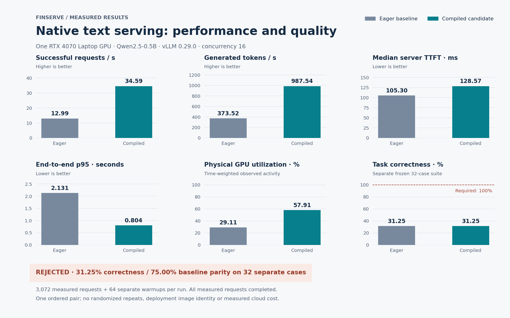
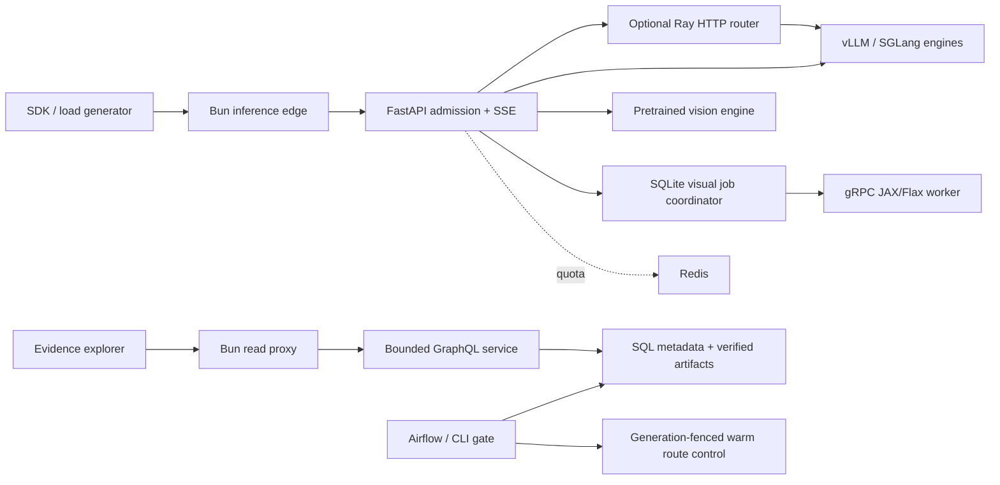

# FinServe

FinServe is a text and image inference platform with a reproducible measurement and release-control path. It connects a Bun edge, FastAPI, separately managed GPU engines, Ray routing and durable visual jobs. An evidence explorer puts throughput, latency, failed quality checks and exact artifact identities in the same view.

A faster server can still return incorrect answers or lose work during cancellation. FinServe measures completed requests and engine-reported tokens, retains failures, and blocks promotion when its quality or identity checks fail.

## Measured results

A native RTX 4070 Laptop experiment compared eager and compiled vLLM 0.29.0 with pinned Qwen2.5-0.5B-Instruct weights. Each configuration retained 3,072 measured requests and 64 separate warmup requests against the same frozen workload at concurrency 16.

| Measurement | Eager baseline | Compiled candidate |
| --- | ---: | ---: |
| Successful requests/s | 12.99 | 34.59 |
| Generated tokens/s | 373.52 | 987.54 |
| Median server TTFT | 105.30 ms | 128.57 ms |
| End-to-end p95 | 2.131 s | 0.804 s |
| Completed requests | 3,072/3,072 | 3,072/3,072 |
| Time-weighted GPU utilization | 29.11% | 57.91% |

Token throughput increased **2.64×**, while median TTFT worsened. Exact output agreement across the paired load requests was **80.70%**. A separate frozen 32-case exact/typed-JSON suite scored **31.25% correctness** and **75% baseline parity**, so the candidate **failed the quality gate**. These are native workstation observations with undeclared deployment images, one ordered pair and no cloud billing evidence. They do not establish production availability or GPU cost savings.

[Results and limitations](docs/results.md) identify the retained evidence, rejected speculation experiment and multimodal checks. The original 94 requests/s, 99.2% parity, 81% utilization and 37% cost-reduction figures remain targets.

A later image-bound Qwen2.5-1.5B diagnostic with explicit chat-role mapping scored 18/32 on the unchanged release suite and 13/20 on a separately frozen format holdout. All requests completed, but correctness still failed. This separate experiment does not change the sustained comparison above.

A subsequent structured-output diagnostic completed all 56 requests and improved correctness to 26/32 on the release suite and 17/20 on the now-consumed holdout. Its release gate still failed; no paired performance gain or model-to-model parity is claimed.

The latest 7B AWQ candidate answered **55/56 consumed regression cases correctly (98.2%)**: 32/32 release, 4/4 historical and 19/20 expanded cases. One time-comparison error remains. A subsequent independent evaluation of the unchanged selected 7B configuration scored **42/48 (87.5%)**, with all requests completed. That quality gate failed. These correctness runs establish no new throughput gain or model-to-model parity. The public results page presents each experiment with its own scope.



## Current capabilities

- **Text serving:** bounded HTTP/SSE admission, cancellation ownership, authoritative token accounting, vLLM/SGLang adapters and an inspectable PyTorch reference decoder. The reference decoder has random weights and is not a quality model.
- **Distributed routing:** a real Ray HTTP bridge to separately managed engine processes, endpoint eligibility, bounded leases and policy selection. Multiple proxy replicas do not imply multiple GPUs.
- **Image plus text:** authenticated single-PNG requests through a pretrained vision model, strict image validation and an actual local-versus-HTTP preprocessing experiment. Three counterfactual chart probes passed; the retained uniform-color suite failed.
- **Visual generation jobs:** a JAX/Flax reference generator behind gRPC, SQLite job ownership, idempotent submission, fenced cancellation and verified PNG artifacts. This is a reference generator, not a pretrained image-generation product.
- **Release evidence:** immutable SQL metadata, local/S3 artifact adapters, MLflow integration, a shared canonical-profile gate for CLI/Airflow and warm route rollback with exact revision checks.
- **Evidence explorer:** read-only GraphQL, paired run metrics, workload slices, quality failures, GPU coverage and request records. The initial read service supports local SQLite and content-addressed files.
- **Observability:** linked private gateway/Ray/engine traces, sanitized local Langfuse ingestion, and a provisioned text-gateway dashboard with tested Prometheus outage alerts. Browser rendering and hosted operations remain separate checks.
- **Infrastructure:** pinned container builds, bounded local Compose services, Helm/KubeRay configuration and a validated Terraform AWS foundation. The [free local setup](docs/run-free.md) runs the full explorer and optional GPU inference without cloud services. A separate static Hugging Face package publishes aggregate results; the Docker explorer passes local container checks. Cloud inference and the full recorded demo remain pending.

## Run locally

For the complete explorer and local GPU setup, follow [Run FinServe without paid hosting](docs/run-free.md). The explorer needs no GPU; real inference uses your local NVIDIA device. Kubernetes is optional for local use.

Browse the [live free results page on Hugging Face](https://huggingface.co/spaces/chinmayarvind/finserve) for the public figures. It is a static site, not an inference endpoint.

Python 3.12, uv and Bun 1.3.10 are the tested development tools. Run the transport fixture first:

```sh
uv sync
uv run uvicorn finserve.gateway.app:from_env --factory --host 127.0.0.1 --port 8000
```

In another terminal:

```sh
curl -N http://127.0.0.1:8000/v1/completions \
  -H 'Content-Type: application/json' \
  -d '{"prompt":"hello","max_tokens":5}'
```

The default fixture echoes character tokens. Set `FINSERVE_API_KEY` to require bearer authentication. For real text inference, configure `FINSERVE_ENGINE=vllm` or `sglang`, `FINSERVE_ENGINE_URL=<internal /v1 URL>` and the exact served `FINSERVE_MODEL`. An external engine must already be running. The API process does not load those GPU weights itself.

[Commands](docs/commands.md) cover verification and measurement. Follow the [Bun edge setup](apps/api/README.md), [explorer setup](apps/web/README.md), [container setup](infra/docker/README.md) and [Airflow setup](pipelines/airflow_dags/README.md) for the separate processes. Keep credentials, databases, artifacts and raw evidence outside the source checkout.

## Architecture



Engines own batching, model execution and GPU memory. Ray owns routing leases. Redis provides optional quota/cache state; it is not the text-stream queue or durable visual-job database. GraphQL stays outside inference scheduling. Deployment profiles bind model, tokenizer, engine configuration and image identities before the gate evaluates promotion.

## Documentation and demo

- [High-level design](docs/HLD.md) and [low-level design](docs/LLD.md)
- [Benchmark methodology](docs/benchmark-methodology.md) and [results](docs/results.md)
- [Multimodal implementation](src/finserve/multimodal/README.md)
- [Deployment](docs/deployment.md) and [demo status](docs/demo.md)

The GIF below comes from an actual Chromium walkthrough of the local evidence explorer. It compares the historical eager/compiled runs and opens their failed quality report. This is recorded evidence browsing; the full inference and rollback demo remains pending. [Capture scope and private video details](docs/demo.md).


## Next improvements

**Product:** expand chart reasoning beyond three functional probes and improve exact-format correctness before accepting an optimized release.

**Architecture:** complete artifact-bound runtime production and extend the verified local two-engine path to multiple GPUs and cloud scaling. Cloud deployment and hosted observability remain pending; the text trace chain passes actual Ray/HTTP integration checks.

**Engineering:** repeat and randomize paired measurements, distinguish physical GPU telemetry from per-engine cache occupancy, measure real billed cost, and exercise node/process loss separately from warm route rollback. These remaining checks are tracked explicitly rather than inferred from passing unit tests.
