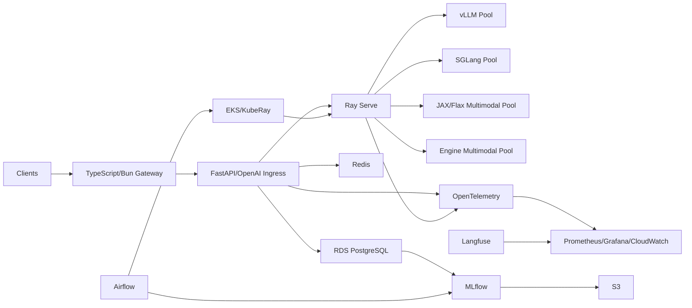

# High-Level Design

## Boundaries

Gateway: auth, API versioning, validation, coarse rate limits. Not GPU scheduling.

Ray Serve: distributed replica lifecycle, routing, autoscaling, placement.

Engine: KV cache, token scheduling, continuous batching, speculation, engine metrics.

Airflow: offline artifact lifecycle. Never blocks a token request.

## Data plane

`client -> ingress -> Ray Serve -> engine -> stream`

## Control/evidence plane

`registry -> Airflow -> deployment -> benchmark -> MLflow -> promote/rollback`

Already-running serving should not require MLflow/Airflow/RDS for every token.
