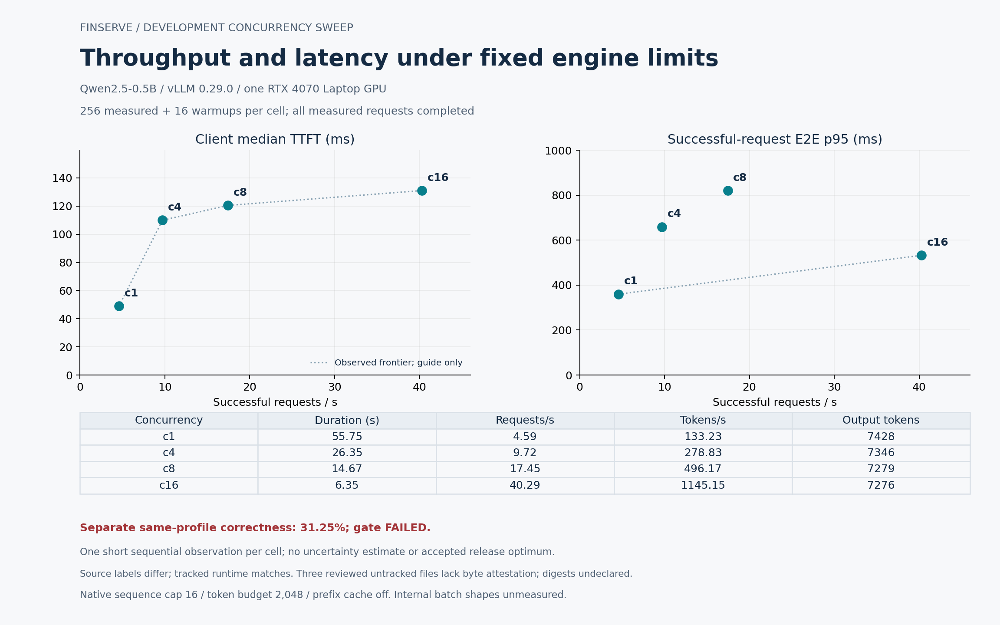

# Performance engineering

No optimized release has passed FinServe's required correctness gate. Measurements retain faster candidates that failed quality and routing cohorts that rejected most offered requests. [Recorded results](results.md) contains the central result table.

## Current evidence

The sustained eager/compiled comparison used the same pinned Qwen2.5-0.5B model, one RTX 4070 Laptop GPU, concurrency 16 and 3,072 measured requests per configuration. Successful-request throughput rose from 12.99 to 34.59 requests/s and token throughput from 373.52 to 987.54 tokens/s. Client median TTFT worsened from 112.95 to 159.45 ms; successful-request end-to-end p95 fell from 2.131 to 0.804 seconds. The separate quality gate failed. One ordered pair leaves thermal and workstation confounds.

Three-token n-gram speculation lost throughput and failed quality at the tested envelope. The preferred profile leaves it disabled. The VLM CPU preprocessing hop added measured round-trip cost while preserving paired output, but its uniform-color semantic gate failed.

The first two-engine routing comparison used two actual vLLM processes on one physical GPU. Four 64-request cohorts completed only 21, 19, 24 and 24 requests. All other requests failed before content; Ray logs identify admission capacity rejection. These results provide no adaptive policy gain. Scale-down succeeded, then restart preflight failed. See [scheduling and batching](scheduling-and-batching.md) for the separate admission-wait correction.

The original targets, including 94 requests/s, improved TTFT, 99.2% quality parity, 81% mean GPU utilization and 37% lower GPU cost, remain unachieved or unmeasured. Local observations contain no cloud invoice or production availability window.

## Fixed-profile concurrency observations



The four compiled development cells used the same 64-case workload repeated four times, 256 measured requests and 16 separate warmups. Only declared client concurrency varied: 1, 4, 8 and 16. Native sequence capacity stayed at 16 and the token/context limits at 2,048; prefix caching and speculation were disabled. These observations characterize admission concurrency under fixed batch limits. They do not measure actual internal batch shapes or isolate a batching-algorithm change.

All 1,024 measured requests completed. The observed TTFT/throughput frontier contains all four points; for p95 completion latency, c4 and c8 are dominated by c16 in this sample. Each point is one short, sequential development run, lasting 55.75, 26.35, 14.67 and 6.35 seconds. There are no repeat-based uncertainty estimates. The separate same-profile 32-case quality cohort achieved 31.25% correctness and failed its gate; quality was not measured independently at every concurrency.

Provenance remains qualified. The c1 environment records source `a2482561fdf833c7d21414cea3ab445269ae2f50`; c4/c8/c16 record `231acc3431623d26c29be9b0e1df7270776a908f` while still declaring the earlier revision. Git tree/blob identities confirm identical tracked `src`, `uv.lock` and `pyproject.toml`; the intervening commit added only quality-suite tooling. Each run also lists three reviewed untracked runtime files: `multimodal/jax_generator.py`, `registry/__init__.py` and `registry/artifacts.py` under `src/finserve`. Their bytes were not archived. The audit requires an explicit exact-path exclusion for each; tracked modifications and unknown untracked runtime paths still reject. No exact dirty-source archive or native image/config digest exists for these runs.

The [aggregate data](assets/concurrency-frontier.json) includes run IDs, raw-record hashes, durations, authoritative output counts, both source identities and the untracked-file exclusions. The [SVG](assets/concurrency-frontier.svg) is available for export. Recompute a fresh external audit with [audit_concurrency_frontier.py](../scripts/audit_concurrency_frontier.py), passing the four `compiled-load-c{1,4,8,16}-01` directories and `quality-compiled-02`. Supply `--allow-untracked-runtime` once for each full reviewed path above. The checkout must contain Git objects for both recorded revisions; the installed evaluator must match the recorded hash, allowing only LF/CRLF normalization. Render that audit with:

```sh
uv run --script scripts/plot_concurrency_frontier.py --audit "$FINSERVE_FRONTIER_AUDIT" --output "$FINSERVE_NEW_FIGURE_DIRECTORY"
```

The 128-request engine comparisons, n-gram profiles, 3,072-request sustained runs and two-engine routing workload remain separate experiments. A common workload hash alone does not make their repetition counts, runtimes or serving boundaries interchangeable.

## Experiment discipline

Freeze revisions, inputs, seed/order, output budgets, concurrency, warmup and acceptance criteria before measurement. Record actual source and launch identity. A copied profile is a declaration; model discovery, process identity and observed hardware supply separate evidence. A later container build cannot retrospectively identify an unrecorded native-run image digest.

Retain every offered request and failed attempt. Compare successful throughput alongside availability and actual generated lengths. Report paired output agreement over a declared denominator and task correctness separately. Development tuning, held-out comparisons and functional smoke tests answer different questions.

GPU means require physical UUIDs, bounded sample gaps, declared warmup exclusion and sufficient coverage. Clock drift can invalidate wall-clock integration. Drain the observer before calculating summaries so a final in-flight sample cannot alter the saved raw population afterward.

## Diagnose before tuning

| Observation | Evidence to inspect |
| --- | --- |
| Admission rejection | Pending requests, leases, reflected leases, native-gauge age and health |
| Slow first content | Upload, queue, routing, prompt length, prefill and transport boundaries |
| Slow completion | Generated length, native batch load, decode rate and cleanup |
| Memory pressure | Physical VRAM, engine KV, active sequences and context budgets |
| Poor quality | Exact input, template, model identity, grader and independent correctness cases |

Increasing queue depth can turn rejection into latency. Dropping conservative telemetry can invent capacity. The admission-wait correction preserves the request deadline and waits for eligible capacity; it needs a separately identified GPU rerun before any performance conclusion.

Cold-start measurements separate process launch, image pull, weights, compilation, memory profiling, readiness and cloud provisioning. Warm-route rollback does not measure those stages. Prefix-cache benefits require a declared prefix distribution. Response caching must be declared separately. Quantization or a different model requires its own correctness comparison.
